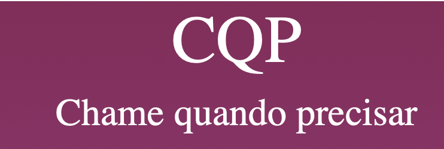

# Apresentação

Pré-requisitos: Todos os demais artefatos

Conjunto de slides em um arquivo PowerPoint ou PDF com a apresentação do projeto contemplando todos os itens trabalhados nos demais artefatos.

## Chame quando precisar

## Identidade Visual (Marca, Design)

O grupo deve ter o cuidado em utilizar figuras, imagens, e cores dentro do contexto da solução proposta, de forma a manter a temática do problema.

## Conjunto de Slides (Estrutura)

<iframe 
  style="width:100%; height:600px;"
  src="https://github.com/ICEI-PUC-Minas-PMV-ADS/pmv-ads-2023-2-e2-proj-chame-quando-precisar/blob/feature/sql_serve_azure/docs/img/slides/index.html"
  frameborder="0"
  allow="accelerometer; autoplay; encrypted-media; gyroscope; picture-in-picture"
  allowfullscreen>
</iframe>